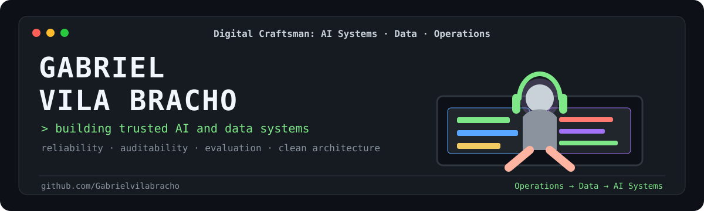

<p align="center">
  
</p>

<h1 align="center">Gabriel Vila Bracho</h1>

<p align="center">
  <strong>AI Systems Builder · Business Intelligence · Operations · Clean Architecture</strong>
</p>

<p align="center">
  <a href="https://www.linkedin.com/in/gabriel-vila-bracho"></a>
  <a href="mailto:gvilabracho@gmail.com"></a>
  <a href="https://github.com/Gabrielvilabracho"></a>
  <a href="https://www.reddit.com/user/Significant-Wafer465"></a>
</p>

---

##  About me

I build trusted AI and data systems for complex business operations.

My career has followed one consistent thread: understanding complex systems, making them measurable, and improving how they work. That path started in mission-critical naval environments, moved through operational leadership and Business Intelligence, and now focuses on production-oriented AI systems.

I care about reliability, auditability, evaluation, and systems that can be trusted before they scale.

```text
Operations → Data → AI Systems → Reliable Decision-Making
```

---

## What I build

| Area | Focus |
|---|---|
| AI Systems | Agents, multi-agent workflows, RAG, MCP integrations, persistent memory |
| Evaluation | Test harnesses, measurable AI behavior, reliability checks, traceable outputs |
| Business Intelligence | KPI models, dashboards, financial models, operational reporting |
| Engineering | Clean architecture, APIs, automation workflows, maintainable systems |
| Operations | Process design, accountability, team workflows, business execution systems |

---

## Languages and tools

### AI, agents and automation


### Engineering


### Frontend and product systems


### Data, backend and cloud


---

## Current focus

- Building AI agents that are reliable before they scale.
- Turning messy operations into measurable workflows and dashboards.
- Designing evaluation-first systems for AI behavior.
- Creating developer workflows powered by memory, specifications, and automation.

---

## GitHub stats

<p align="center">
  
  
</p>

---

## Collaboration

I am interested in projects where AI, data, and operations meet: internal tools, automation platforms, decision systems, agentic workflows, and products that need to be useful beyond the demo.

If the problem is complex, messy, and business-critical, that is exactly where I like to work.
